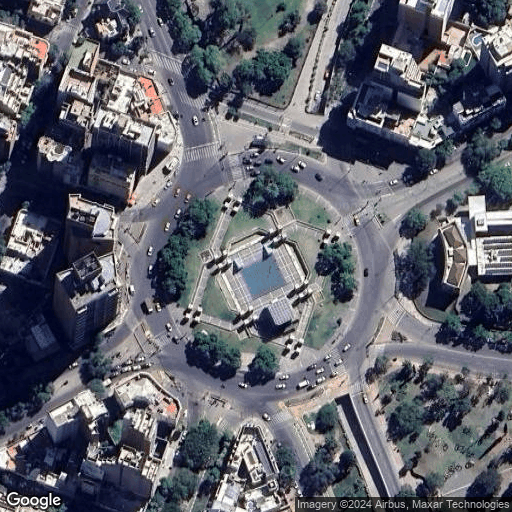

# Google Maps Image Downloader

A Python script for downloading static map images from Google Maps using the Google Static Maps API. The script allows customization of location, zoom level, map type, and image size. The images can be returned as NumPy arrays for further processing or visualization.

## Features
- Download static map images from Google Maps API
- Specify zoom level, map location, map type, and image size
- Convert images to NumPy arrays for easy manipulation
- Basic error handling and validation of inputs

## Requirements
- Python 3.x
- Google Maps API key
- Libraries: `requests`, `PIL`, `numpy` and  `matplotlib`, `argparse` (for `main.py`)

## Installation
1. Clone this repository:
    ```bash
    git clone https://github.com/your-repo/google-maps-image-downloader.git
    cd google-maps-image-downloader
    ```

2. Set up your Google Maps API key in the script (see `secret_key` variable). Alternatively, you may want to set your `secret_key` as an environment variable as `os.getenv('GOOGLE_MAPS_API_KEY')`.

## Usage
The main script uses the `argparse` library to take command-line inputs for map parameters such as location, zoom level, and map type. Below is the command-line usage.

### Command-Line Arguments
- `--zoom`: The zoom level of the map (default: 18). Valid zoom levels are 0 to 22.
- `--location`: Latitude and longitude of the map center in the format `lat lon` (required).
- `--maptype`: The type of map to download (choices: `roadmap`, `satellite`, `hybrid`, `terrain`; default: `satellite`).
- `--size`: The size of the image in pixels in the format `size_x size_y`(default: (512,512)).

### Example
Simplest usage:
```bash
python main.py --location -31.428489 -64.184853
```
This will download a 512x512 satellite image centered at the coordinates (-31.428489, -64.184853) with a zoom level of 18.

It is also possible to specify the  `zoom`,  `size`and `maptype`:
```bash
python main.py --location -31.428489 -64.184853 --zoom 18 --maptype satellite --size 512 512
```

It will download a 512x512 satellite image with a zoom level of 18 centered at Plaza España, Córdoba, Argentina.


## Code Overview

### Downloader Class

The `GoogleMapsImageDownloader` class is responsible for making requests to the Google Static Maps API and downloading images. Here’s a brief description of its main methods:

- `__init__(self, location, zoom, size, maptype, secret_key)`: Initializes the downloader with the required parameters.
- `validate_parameters(self)`: Validates the provided zoom level, map type, size, and location.
- `generate_url(self)`: Generates the API request URL based on the input parameters.
- `request(self, return_as_numpy=True)`: Makes the API request and returns the image as a NumPy array or raw bytes.

### Example Code

The following code demonstrates how to use the downloader:

```python
from downloader import GoogleMapsImageDownloader

# Define your Google Maps API key
secret_key = 'your-api-key'

# Define parameters
location = (-31.428489, -64.184853)  # Latitude, Longitude for Plaza Espa#a-
zoom = 18
maptype = 'satellite'
size = (512, 512)

# Create an instance of the downloader
downloader = GoogleMapsImageDownloader(location=location,
                                       zoom=zoom,
                                       size=size,
                                       maptype=maptype,
                                       secret_key=secret_key)

# Download the image
# if return_as_numpy=False it will return the raw bytes.
image_array = downloader.request(return_as_numpy=True)

# Print image shape and show it using matplotlib
print(image_array.shape)

from matplotlib import pyplot as plt
plt.imshow(image_array)
plt.axis('off')
plt.show()

```

## Example Output
This code will output a 512x512 satellite image centered at the specified coordinates.

```
(512, 512, 3)
````



## License
This project is licensed under the CC BY 4.0 License. See the LICENSE file for more details.
The usage of Google Imagery must respect the Google Earth terms and conditions [https://about.google/brand-resource-center/products-and-services/geo-guidelines/]

## Contact
Matias Molina
molinamatiasd@gmail.com
